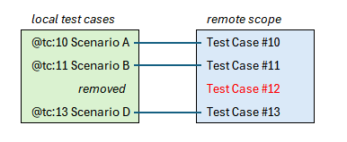

# Remote scope

A *remote scope* is a configuration setting in SpecSync that defines the set of Azure DevOps Test Cases that are to be considered for synchronization from a particular SpecSync configuration. 

The primary purpose of the remote scope is to detect if a local test case has been removed, for example when a scenario has been deleted from a feature file (see details [below](#processing-removed-local-test-cases)). The remote scope is also used for [pull command](../pull-features/two-way-synchronization.md#creating-new-scenarios-from-test-cases) to create new local test cases based on Azure DevOps Test Cases.

Configuring a remote scope is optional, but recommended. If no remote scope is configured SpecSync will not be able to detect removed local test cases and the related option for the pull command will not be available.

The remote scope is configured using the `remote/scope` configuration section. When configuring the remote scope, you can choose from different options on how the remote scope should be maintained by SpecSync. When changing the remote scope configuration, you need to perform a full (unfiltered) *push* synchronization so that the remote scope is established.


This feature has been significantly improved in SpecSync v5 and the configuration has been changed. In earlier versions only `testSuite` remote scope type was available that was configured using the `remote/testSuite` configuration setting. 
For trying out the new extended behavior, please check the [preview version of v5](../../changelog.md#v5).


The following configuration file configures a *tag remote scope*.


```json
{
  "$schema": "https://schemas.specsolutions.eu/specsync4azuredevops-config-v5-latest.json",
  "compatibilityVersion": "5",
  "configurationKey": "my-project-config",
  "remote": {
    "projectUrl": "[...]",
    "scope": {
      "type": "tag"
    }
  },
  ...
}
```


The following table contains an overview of the possible options. Please check the section [How to choose remote scope type](#how-to-choose-remote-scope-type) for help to decide.

| Type | Description |
|------|-------------|
| `tag` | The Azure DevOps Test Cases in the remote scope are marked with the tag `specsync:<config-key>` (this is a remote-only tag, it will not be synchronized to a local tag during *pull*). The advantage of this remote scope type that it is easy to know from a Test Case that it was synchronized from a particular SpecSync configuration and you can also use the tag for querying Test Cases in Azure DevOps. In order to use the *pull* command for crating new local tests from Azure DevOps Test Cases, the new Test Cases can be added manually to the remote scope by adding the tag to the Test Case. The disadvantage is that the additional Azure DevOps tag might be disturbing. In order to use this remote scope type you need to specify a [configuration key](configuration-key.md). |
| `managedQuery` | The IDs of the Azure DevOps Test Cases in the remote are stored in an Azure DevOps shared query (or queries) within the `.SpecSync.Internal` folder. These queries are for SpecSync internal use, Azure DevOps users must not change the query manually. The advantage of this remote scope type is that it works seamlessly with the least disturbance for the users. The disadvantage is that it is not possible to add a Test Case to the remote scope manually. In order to use this remote scope type you need to specify a [configuration key](configuration-key.md). |
| `testSuite` | The Azure DevOps Test Cases in the remote scope are included in a single Test Suite of a Test Plan ([hierarchy of Test Suites](synchronizing-test-case-hierarchies.md) cannot be used). The Test Suite has to be configured using the `remote/scope/testSuite` section with either the `name`, `id` or `path` of the Test Suite. It is strongly recommended to also specify the Test Plan using the `testPlan` setting (see a complete example below). The Test Suite is managed by SpecSync and you cannot include additional Test Cases to it. Furthermore the Test Suite cannot be reused for other SpecSync configurations. This remote scope type was the only supported type before SpecSync v5. The advantage of this remote scope type is that it is backwards compatible with SpecSync v3.4 or earlier configurations and that the same Test Suite can also be used for [publishing test results](../test-result-publishing-features/publishing-test-result-files.md). The disadvantage is that with many Test Cases using a single Test Suite is not convenient. (You can include the same Test Cases to other Test Suites using the [Hierarchy synchronization](synchronizing-test-case-hierarchies.md) feature though.) |

The following configuration file configures a *managed query remote scope*.


```json
{
  ...
  "configurationKey": "my-project-config",
  "remote": {
    "projectUrl": "[...]",
    "scope": {
      "type": "managedQuery"
    }
  },
  ...
}
```


The following configuration file configures a *test suite remote scope*.


```json
{
  ...
  "remote": {
    "projectUrl": "[...]",
    "scope": {
      "type": "testSuite",
      "testSuite": {
        "testPlan": "My Plan",
        "name": "BDD Scenarios"
      }
    }
  },
  ...
}
```


## How to choose remote scope type

Choosing the ideal remote scope type might require some considerations. This section helps to make the right choice. Nevertheless the chosen remote scope type can be changed later, with minimal efforts and impact on the synchronized Test Cases. (If you change the remote scope type, make sure you perform a full (unfiltered) *push* synchronization so that the remote scope is established.)

* As a general **default recommendation**, we suggest to choose the `managedQuery` remote scope type, because that is the easiest to configure and works optimal in the most situations.
* If your configuration needs to be **backwards compatible** with SpecSync v3.4 or earlier (e.g. other processes depend on a single Test Suite containing all synchronized Test Cases) or you would like to **delay the decision** after migrating to v5, you should choose the `testSuite` remote scope type, because that is a compatibly direct replacement of the remote scopes configured with `remote/testSuite` earlier. The [Upgrade configuration wizard](../general-features/configuration-wizards.md#upgrade-wizard) can be used to upgrade the old setting to a `testSuite` remote scope.
* If you often need to **construct Azure DevOps queries** that list Test Cases synchronized from a particular SpecSync configuration (e.g. make a query that lists all synchronized Test Cases from the synchronized backend tests that are in "Design" state), you should consider the `tag` remote scope type, because you can use the added tags in Azure DevOps queries.
* If you often use SpecSync to **create local test cases** (scenarios) **from Test Cases** manually created in Azure DevOps using the [*pull* command](../pull-features/two-way-synchronization.md#creating-new-scenarios-from-test-cases), you should consider `tag` or `testSuite` remote scope types, because with these you can add Test Cases to the remote scope manually in Azure DevOps. (For other remote scope types, you can still use the [alternative workflow](../pull-features/two-way-synchronization.md#alternative-workflow-for-creating-new-scenarios-from-test-cases).)
* If you would like to have the **least disturbance** and the **least impact on the Test Cases**, you should consider the `managedQuery` remote scope type.


## Processing removed local test cases

As mentioned above the the primary purpose of the remote scope is to detect if a local test case has been removed, for example when a scenario has been deleted from a feature file.

This detection is performed during *push* synchronization in a way that SpecSync loads the Test Case IDs that are in remote scope and matches them to the processed local test cases (e.g. scenarios) as the following example shows.



In this example, the Test Case #12 is in the remote scope, because SpecSync has included it earlier when the related scenario was synchronized. The scenario has been removed from the feature file, so SpecSync will not find a matching scenario for Test Case #12 therefore it is considered to be removed.

### Tagging removed Test Cases


SpecSync never deletes Azure DevOps Test Cases to avoid data loss.


The Test Cases corresponding to the deleted local test are not deleted from Azure DevOps to avoid data loss, but they are tagged with `specsync:removed`. The tagged Test Cases can be deleted by the user in Azure DevOps if they are not required anymore.

If the SpecSync configuration has a [configuration key](configuration-key.md) specified, the removed Test Cases will be tagged with a `specsync:removed-from:<config-key>` tag in addition to `specsync:removed`. This can help identifying which configuration was used to synchronize this Test Case earlier.

### Excluding removed Test Case from hierarchies

SpecSync can synchronize Test Cases into hierarchical structures using the [Test Case hierarchies](synchronizing-test-case-hierarchies.md) feature. These structures are also maintained with removed test cases if remote scopes are used. 

This means that whenever SpecSync detects a test case as removed, it will excluded it from any Test Case hierarchy it was previously included in.

### Detection of removed test cases with filtered synchronization

The *push* synchronization can be limited to a smaller set of test cases using the [`--filter` command line option](../../reference/command-line-reference/push-command.md). This is usually used to quickly synchronize the set of the test cases the user is currently working on and not to check if test cases have been removed from the entire configuration.

Therefore **by default SpecSync the removed test detection is disabled when a filtered synchronization is performed**. 

This behavior can be modified by setting the `toolSettings/forceProcessingRemovalsOnFilter` configuration option to `true`. 

### Undo removal

Thanks to the fact that SpecSync does not delete, but only tag the removed Test Cases, the removal is reversible.

If the removed local test case (scenario) is restored and a *push* synchronization is performed, SpecSync will detect that there is already a Test Case corresponding to the restored local test case and it simply removes the added `specsync:removed` and `specsync:removed-from:<config-key>` tags. The restored Test Case will be included again to the remote scope and to any [Test Case hierarchies](synchronizing-test-case-hierarchies.md) it has been removed from. With that the original state is restored.

