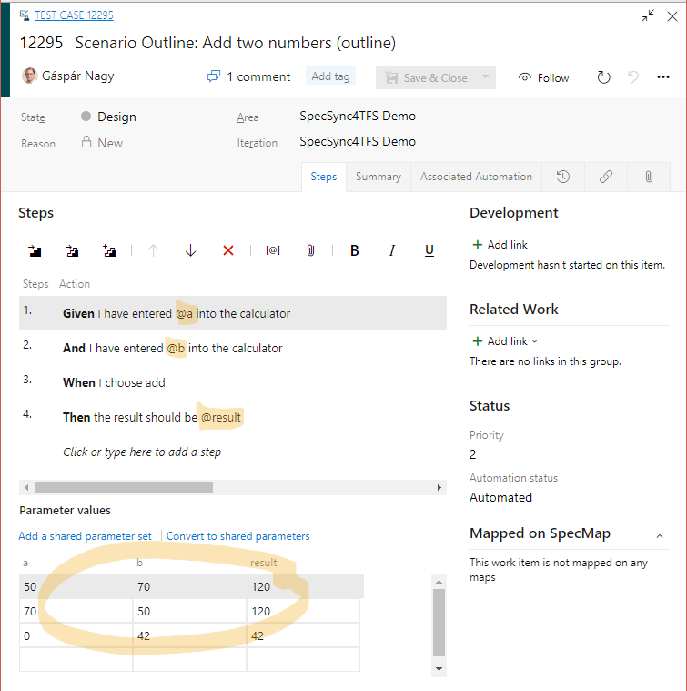

# Synchronizing Scenario Outlines

Scenario Outlines can be used to specify business rules that can be represented with a table of input-output pairs. The following example shows a scenario outline for specifying the addition function of a calculator.

```text
Scenario Outline: Add two numbers
    Given I have entered <a> into the calculator
    And I have entered <b> into the calculator
    When I press add
    Then the result should be <result> on the screen

Examples: 
    | description   | a  | b  | result |
    | classic       | 50 | 70 | 120    |
    | commutativity | 70 | 50 | 120    |
    | zero          | 0  | 42 | 42     |
```

This scenario outline represents three executable tests, one for each row of the `Examples` table.

In Azure DevOps, parametrized test cases can be created for the similar problems. A Test Case automatically becomes parametrized, once you use a parameter \(e.g. `@myparam`\) in the Test Case steps. The parameter values can be specified in a separate table, similarly to scenario outlines: one row in the parameter values table represents one test, called iteration.

SpecSync synchronizes scenario outlines automatically to parametrized test cases. Once the scenario outline above is synchronized, it produces a test case like this.




The scenario outline above has a column in the examples table ("description") that is not used in the scenario steps. In Azure DevOps you can only list parameters if they are included in one of the steps, so to be able to preserve the parameter values, with SpecSync v3.3 or later SpecSync will automatically add a last pseudo-step that lists all parameters, including the "description" value. This behavior can be customized using the `synchronization/format/showParameterListStep` configuration setting. The default value is `whenUnusedParameters` but you can force to generate the pseudo-step always using the value `always` or completely disable using the value `never`.

The image above shows the behaviour with the `never` option (the behaviour prior to v3.3).



## Special considerations for test-suite based execution

When the legacy [test-suite based execution](../test-result-publishing-features/support-for-azure-devops-test-plan-test-suite-based-test-execution.md) method with SpecFlow, the test case has to be associated with a single test method \(normally SpecFlow generates multiple test methods for the Scenario Outline, one for each example\). To be able to produce such a single test method, a SpecFlow plugin has to be used that is provided by SpecSync. See more about this at the [Support for Azure DevOps Test Plan / Test Suite based test execution](../test-result-publishing-features/support-for-azure-devops-test-plan-test-suite-based-test-execution.md) page.
