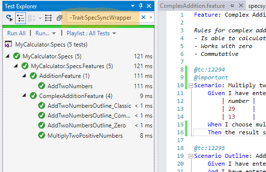
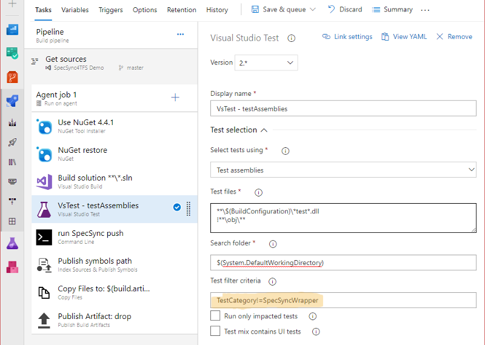

# Support for Azure DevOps Test Plan / Test Suite based test execution

The SpecSync publish-test-results command provides a general-purpose solution for publishing test results to Azure DevOps as described in the [Publishing test result files](publishing-test-result-files.md) page. That works with many BDD tools and platforms.

For **MsTest-based SpecFlow or Reqnroll scenarios**, you can also execute and publish the test results using the Test Suite based execution feature of Azure DevOps. That kind of execution can be invoked from build or releases pipelines using the Visual Studio Test (VSTest) task.&#x20;

.png>)

The test execution uses the _Associated Automation_ field of the Test Cases in the Suite: it invokes the test method specified in the field from the compiled test assembly of the current build. The results are attached to the Test Case.

SpecSync can configure the _Associated Automation_ field with the test method generated by SpecFlow or Reqnroll for the scenario. For that you have to enable [marking Test Cases as automated](../push-features/mark-test-cases-as-automated.md) and you have to specify the `testSuiteBasedExecutionWithScenarioOutlineWrappers` value for the [`synchronization/automation/testExecutionStrategy` configuration](../../reference/configuration/configuration-synchronization/configuration-synchronization-automation.md) setting. The following example shows such a configuration.


```javascript
{
  ...
  "synchronization": {
    ...
    "automation": {
      "enabled": true,
      "testExecutionStrategy": "testSuiteBasedExecutionWithScenarioOutlineWrappers"
    },
    ...
  },
  ...
}
```



The `testExecutionStrategy` setting can also be set to `testSuiteBasedExecution`, but that setting is currently not supported for scenario outlines by Azure DevOps and SpecFlow.


Unfortunately this test execution method have a couple of limitations and drawbacks:

* The method can only be used for SpecFlow or Reqnroll-based .NET projects.
* Officially (by Azure DevOps) the support is only provided for MsTest-based SpecFlow or Reqnroll projects only, but it seems to be working with NUnit and xUnit as well. SpecFlow+ Runner is not supported.
* To be able to execute scenario outlines this way, SpecSync needs to generate a special wrapper method for the scenario outlines. This requires a SpecFlow plugin to be configured and **the special wrapper method needs to be excluded manually on every local test run**.

You can find more information about setting up the SpecFlow plugin in the [Setup and Configure](../../installation/setup-and-configure.md#setup-specflow-plugin) page. The section [Exclude scenario outline wrapper method](support-for-azure-devops-test-plan-test-suite-based-test-execution.md#exclude-scenario-outline-wrapper-method) contains information about how to exclude the wrapper method in local or assembly based pipeline executions.

Especially because of the problem with the scenario outline wrapper methods, using this approach is not recommended. If you have questions or need help to setup this model, please [contact support](../../contact/specsync-support.md). You can also consider the SpecSync [Test result publishing features](./) that provide a more flexible solution.

## Exclude scenario outline wrapper method

### Exclude wrapper methods in local test execution

For each Scenario Outline, there will be an additional wrapper test generated that will be used by the automated test case. Running these tests locally is unnecessary, therefore it is recommended to filter them out from local execution. This can be done for example by entering the `-Trait:SpecSyncWrapper` filter criteria to the search box of the "Test Explorer" window. (See more in [SpecFlow configuration](../../reference/configuration/configuration-specflow.md).)&#x20;



### Exclude wrapper methods in Azure DevOps build or release pipeline

When the tests are run in Azure DevOps build from assembly (so not through the test cases), the generated wrapper methods have the be filtered out as well. This can be achieved by entering the `TestCategory!=SpecSyncWrapper` expression as "Test Filter criteria".



## Use TestCase Data for Scenario Outline examples for legacy MsTest V1 projects


Note: this option is only available for legacy MsTest V1 based projects that use SpecFlow v2.3 or v2.4.

The legacy MsTest (V1) framework can be configured by adding a reference to the "Microsoft.VisualStudio.QualityTools.UnitTestFramework" assembly to your project. The MsTest-related NuGet packages (MSTest.TestFramework, MSTest.TestAdapter) cannot be used!


The "_Use TestCase Data_" mode connects to the TFS TestCase during execution of Scenario Outlines to retrieve the examples. In this setup, the generated Scenario Outline Wrapper is not executable locally.

In order to configure SpecSync to use this option, you need to do the following steps:

1. Make sure your project uses MsTest V1 (has a reference to the "Microsoft.VisualStudio.QualityTools.UnitTestFramework" assembly and does not use MsTest through NuGet). Using this option with MsTest V2 will lead to an error, like _"The unit test adapter failed to connect to the data source or to read the data. \[...] Unable to find the requested .Net Framework Data Provider. It may not be installed."_
2. Make sure your project uses SpecFlow v2.3 or v2.4
3. Setup SpecSync to use `testSuiteBasedExecutionWithScenarioOutlineWrappers` automation strategy and the SpecSync SpecFlow plugin like it is described above.
4. Set `specflow/scenarioOutlineAutomationWrappers` in the configuration file to `useTestCaseData`.
5. Add a Test Settings file (`.testsettings`) to your project (without any special configuration) or a [Run Settings](https://docs.microsoft.com/en-us/visualstudio/test/configure-unit-tests-by-using-a-dot-runsettings-file?view=vs-2017#mstest-run-settings) file with `ForcedLegacyMode` set to `true`. You can download a sample Test Setting file from [here](https://content.specsolutions.eu/specsync/TestSuiteBasedRun.testsettings).
6. In the VsTest task of the build pipeline, browse the added Test or Run Settings file at the "Settings file" setting.
