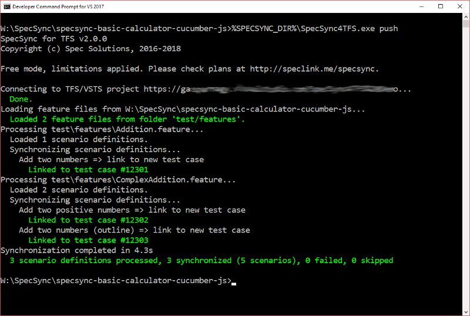
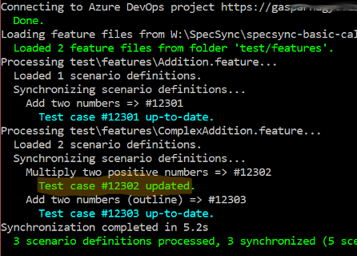
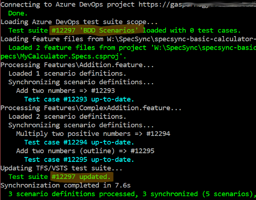
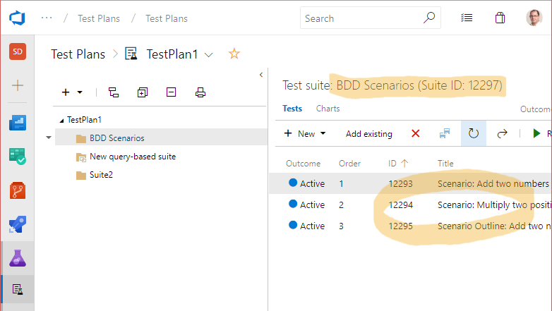

# Getting started using Cucumber or other Gherkin-based BDD tool

This chapter goes through the setup and the synchronization steps for non-SpecFlow projects. For SpecFlow projects, please check page [Getting started using SpecFlow](getting-started-specflow.md).

SpecSync can synchronize any scenarios that are written in Gherkin format. Gherkin format is used by many tools in many platforms, like Cucumber, Cucumber JVM, Cucumber.js, Behat, Behave and also SpecFlow.

SpecSync can also be used to publish test results of various Cucumber projects including Cucumber Java, Behave and SpecFlow so that Azure DevOps can track the historical test executions and provide you with various reports. To be able to publish the test results, the [publish-test-result](../reference/command-line-reference/publish-test-results-command.md) command has to be used.

The SpecSync synchronization tool can be executed as a command line tool from Windows, macOS and Linux-based systems. See [Installation & Setup](../installation/) and [Using SpecSync on macOS or Linux](../important-concepts/using-specsync-on-osxlinux-page.md) pages for details.

In this guide we will use Cucumber.js as an example, but the steps can also be applied for other tools as well.

## Preparation

For setting up SpecSync for Azure DevOps, you need a Cucumber project and an Azure DevOps project. For the supported Azure DevOps versions, please check the [Compatibility](../reference/compatibility.md) list.

In our guide, we will use a calculator example \(my\_calculator\) that uses Cucumber.js v5.1. The sample project can be downloaded from [GitHub](https://github.com/gasparnagy/specsync-basic-calculator-cucumber-js).

For a synchronization target we use an Azure DevOps project: `https://specsyncdemo.visualstudio.com/MyCalculator`. (An Azure DevOps project for testing SpecSync can be created for free from the [Azure DevOps website](https://azure.microsoft.com/en-us/services/devops/)).

## Installation

Install SpecSync using one of the [available installation options](../installation/) on your operating system. In this guide we assume you have downloaded one of the native binaries and it to a folder on your system. 

Set an environment variable `SPECSYNC_DIR` to the folder where the SpecSync executable \(`SpecSync4AzureDevOps`\) is extracted to \(depending on the package it might be the `tools` folder of the extracted zip file\).

## Initialize configuration

Initialize the SpecSync configuration in your local repository root by invoking the SpecSync init command. This command will create a SpecSync configuration file `specsync.json`.

```text
$SPECSYNC_DIR/SpecSync4AzureDevOps init
```

The init command will ask you for your [Azure DevOps project URL](../important-concepts/what-is-my-server-url.md) and the [authentication credentials](../features/general-features/server-authentication-options.md). Alternatively you can manually create the configuration based on an empty configuration file downloadable from http://schemas.specsolutions.eu/specsync-empty.json.

## Basic configuration

The init command configured the connection details to your Azure DevOps project, but there are a few other things that has to be configured before the first synchronization.

In our sample application the feature files are located at the `test/features` folder. We need to specify this in the [local section](../reference/configuration/configuration-local.md) of the configuration file.

Before the first synchronization we have to review and change a few settings in this file. For this example we will synchronize all feature files within the `test/features` folder. For synchronizing only a specific set of feature files, please check the [`local` Configuration](../reference/configuration/configuration-local.md) documentation.

1. Open the `specsync.json` file in your IDE \(e.g. Visual Studio Code\) from your project folder.
2. Set the value of the `local/featureFileSource/type` setting to `folder` and the `local/featureFileSource/folder` setting to `test/features`. This will instruct SpecSync to process the feature files from that specific folder.


If feature file source is not specified, SpecSync will synchronize the feature files from the folder of the configuration file \(including subfolders\).


The `specsync.json` file after basic configuration has been set


```javascript
{
  "$schema": "http://schemas.specsolutions.eu/specsync4azuredevops-config-latest.json",

  // See configuration options and samples at http://speclink.me/specsyncconfig.
  // You can also check the 'specsync-sample.json' file in the 'docs' folder of the NuGet package.

  "remote": {
    "projectUrl": "https://specsyncdemo.visualstudio.com/MyCalculator",
    "user": "52yny........................................ycsetda"
  },
  "local": {
    "featureFileSource": {
      "type": "folder",
      "folder": "test/features"
    }
  }
}
```


## First synchronization

1. Make sure your project compiles and runs. 
2. We recommend starting from a state where 
   * all tests pass,
   * the modified files are checked in to source control.
3. Open a command line prompt and navigate to the project root folder
4. Invoke SpecSync push command:

   ```text
   $SPECSYNC_DIR/SpecSync4AzureDevOps push
   ```

5. If you haven't specified any credentials in the configuration file, an authentication dialog will popup, where you have to specify your credentials for accessing the Azure DevOps project.

As a result, the scenarios from the project will be linked to newly created Azure DevOps test cases, and you will see a result like this.



Scenarios are synchronized to normal, Scenario Outlines to parametrized Test Cases.


_Useful hint for testing:_ Normally you cannot delete work items from Azure DevOps, so testing the initial linking is harder. If you have Visual Studio installed, there is a tool called `witadmin` available from the VS command prompt. With the `destroywi` command of this tool you can delete work items. See `witadmin help destroywi` for details, and use it carefully.


## Check Test Case in Azure DevOps

1. Find one of the created test case in Azure DevOps. The easiest way to do this is to open the Azure DevOps URL in a browser and specify the test case ID \(e.g. `#12302)` in the "Search" text box in the upper right corner of the web page.

You should see something like this.


There are a couple of things you can note here.

* The name of the scenario has been synchronized as the title of the test case. \(The "Scenario:" prefix can be omitted by changing the [synchronization format configurations](../reference/configuration/configuration-synchronization/configuration-synchronization-format.md).\)
* The tags of the scenario have been synchronized as test case tags (labels).
* The steps of the scenario have been synchronized as test case steps. \(The _Then_ steps can also be synchronized into the _Expected result_ column of the test case step list and you can [change a couple of other formatting options](../reference/configuration/configuration-synchronization/configuration-synchronization-format.md) as well.\)

## Verify feature file and commit changes

1. Open one of the feature files from in the IDE. SpecSync modified the file and added a few tags.
2. Each scenario and scenario outline has been tagged with a `@tc:...` tag making the link between the scenario and the created test case.

```text
@tc:1234
@important
Scenario: Add two positive numbers
```


The feature files are changed only when synchronizing new scenarios \(linking\). To avoid file changes \(e.g. when running the synchronization from a build server\) the `--disableLocalChanges` command line switch can be used. See [Synchronizing test cases from build](../important-concepts/synchronizing-test-cases-from-build.md) for details.


Verify if the project still compiles and the tests pass \(they should, since we have only added tags\), and commit \(check-in\) your changes.

## Synchronize an update

Now let's make a change in one of the scenarios and synchronize the changes to the related test case.

1. Update the title and the steps of the scenario, for example change the scenario `Add two positive numbers` to `Multiply two positive numbers`, change `add` to `multiply` in the _When_ step and update the expected result to `377`:

   ```text
   @tc:1234
   Scenario: Multiply two positive numbers
     Given I have entered the following numbers
        | number |
        | 29     |
        | 13     |
     When I choose multiply
     Then the result should be 377
   ```

2. Make sure it still compiles and the test passes.
3. Run the synchronization again:

   ```text
   $SPECSYNC_DIR/SpecSync4AzureDevOps push
   ```

The result shows that the test case for the scenario has been updated, but the other test cases have remained unchanged \(_up-to-date_\).



1. Refresh the test case in your browser to see the changed title and steps.

   


For executing complex test cases, further verification and planning steps might be required after the test case has been changed. SpecSync can reset the test case state to a configured value \(e.g. `Design`\) in order to ensure that these steps are not forgotten. For more information on this, check the [synchronization state configuration](../reference/configuration/configuration-synchronization/configuration-synchronization-state.md) documentation.


## Group synchronized test cases to a test suite

We have seen already how to synchronize scenarios to test cases. To be able to easily find these Test Cases in Azure DevOps, they can be added to Test Suites. SpecSync can automatically add/remove the synchronized test cases to a Test Suite. For this you have to specify the name or the ID or the name of the test suite in the configuration.

1. Create a "Static suite" \(e.g. "BDD Scenarios"\) in Azure DevOps. \(For that you have to navigate to "Test plans" and create and select a test plan first.\)
2. Specify the name of the test suite in the `remote/testSuite/name` entry of the `specsync.json` file.

   ```javascript
   {
     "$schema": "http://schemas.specsolutions.eu/specsync4azuredevops-config-latest.json",

     // See configuration options and samples at http://speclink.me/specsyncconfig.
     // You can also check the 'specsync-sample.json' file in the 'docs' folder of the NuGet package.

     "remote": {
       "projectUrl": "https://specsyncdemo.visualstudio.com/MyCalculator",
       "user": "52yny4a......................................ycsetda",
       "testSuite": {
         "name": "BDD Scenarios"
       }
     },
     //[...]
   }
   ```

3. Make sure that the project compiles and the tests pass.
4. Run the synchronization again:

   ```text
   $SPECSYNC_DIR/SpecSync4AzureDevOps push
   ```


_The test suite names are not unique in Azure DevOps. If the same name is used for multiple suites, you should specify the test suite ID in the_ `remote/testSuite/id` _setting instead._


The synchronization will proceed with the result similar to this.



SpecSync has added the test cases to the test suite.




For projects with many Test Suite it is recommended to also specify the Test Plan ID, where the Test Suite belongs to. This makes the synchronization faster.


## Publishing test results \(optional\)

So far we have shown how to keep the Azure DevOps Test Cases in sync with the scenarios in the feature files. This provides you easily accessible documentation and traceability. The synchronized Test Cases can also be executed as manual tests from Azure DevOps.

To turn the Test Cases into a living documentation, you can also publish test results of the scenarios connected to the Test Cases. 

For that you need to execute the tests and use the [publish-test-result command](../reference/command-line-reference/publish-test-results-command.md) of SpecSync to publish these results to Azure DevOps. SpecSync supports several test result file formats and BDD tools. The list of currently supported tools can be found on the [Compatibility](../reference/compatibility.md#supported-test-result-formats) page. 


The list of supported formats are constantly growing and you can also create a SpecSync plugin to support your own test result format.



To be able to publish test results to Azure DevOps, the Test Cases have to be added to a Test Suite. In this guide we have configured SpecSync to add them to a Test Suite called `BDD Scenarios` in an earlier step.


The following example shows how to publish a Cucumber Java test result file.

```bash
dotnet specsync publish-test-results --testResultFile mytestresult.xml 
  --testResultFileFormat cucumberJavaJUnitXml
```

The command analyses the test result file and connects the results with the scenarios to be able to associate them to Test Cases. You can find the created Test Run in the _Test Plans / Runs_ section of your Azure DevOps portal.

