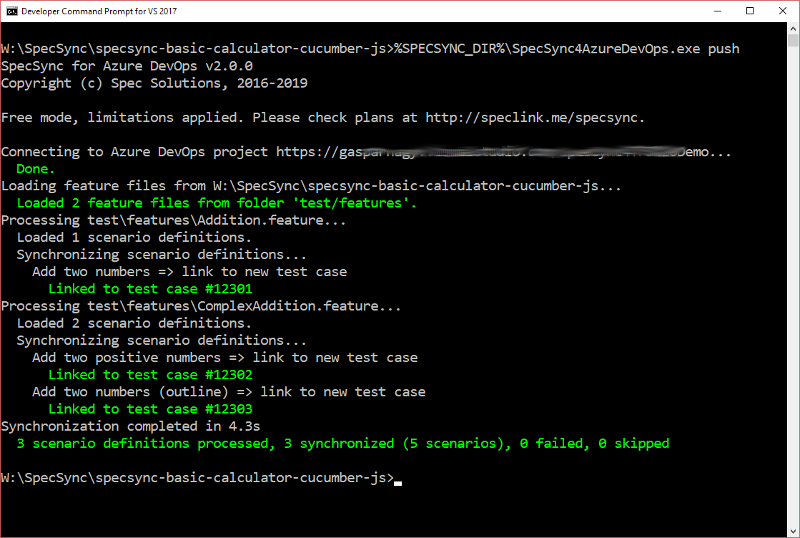

# Getting started using Cucumber or other Gherkin-based BDD tool

This chapter goes through the setup and the synchronization steps for non-SpecFlow projects. For SpecFlow projects, please check page [Getting started using SpecFlow](getting-started-specflow.md).

SpecSync can synchronize any scenarios that are written in Gherkin format. Gherkin format is used by many tools in many platforms, like Cucumber, Cucumber JVM, Cucumber.js, Behat, Behave and also SpecFlow.

If your scenarios are automated with a tool other than SpecFlow, SpecSync will synchronize them as non-automated Azure DevOps Test Cases, because currently Azure DevOps only supports specifying .NET automation for the test cases. The synchronized non-automated test cases can be managed, linked and structured in Azure DevOps. You can also run them manually.

The SpecSync synchronization tool can be executed as a command line tool from Windows, OSX and Linux-based systems. See [Using SpecSync on OSX/Linux](../important-concepts/using-specsync-on-osxlinux-page.md) page for details.

In this guide we will use Cucumber.js as an example, but the steps can also be applied for other tools as well.

## Preparation

For setting up SpecSync for Azure DevOps, you need a Cucumber project and a Azure DevOps project. For the supported Azure DevOps versions, please check the [Compatibility](../reference/compatibility.md) list.

In our guide, we will use a calculator example \(my\_calculator\) that uses Cucumber.js v5.1. The sample project can be downloaded from [GitHub](https://github.com/gasparnagy/specsync-basic-calculator-cucumber-js).

For a synchronization target we use an Azure DevOps project: `https://specsyncdemo.visualstudio.com/MyCalculator`. \(An Azure DevOps project for testing SpecSync can be created for free from the [Azure DevOps website](https://azure.microsoft.com/en-us/services/devops/)\).

## Installation

Download SpecSync from the [downloads page](../downloads.md) and unzip it to a folder on your system.

The package contains the synchronization command line tool \(`tools/SpecSync4AzureDevOps.exe`\) and some documentation files \(`docs` folder\).

## Basic configuration

Create a configuration file \(`specsync.json`\) to your project root, based on the `docs/specsync-empty.json` file. The empty file can also be downloaded from [http://schemas.specsolutions.eu/specsync-empty.json](http://schemas.specsolutions.eu/specsync-empty.json).

```javascript
{
  "$schema": "http://schemas.specsolutions.eu/specsync4azuredevops-config-latest.json",

  // See configuration options and samples at http://speclink.me/specsyncconfig.
  // You can also check the 'specsync-sample.json' file in the 'docs' folder of the NuGet package.

  "remote": {
    "projectUrl": "<specify your Azure DevOps project ULR>"
  }
}
```

Before the first synchronization we have to review and change a few settings in this file. For this example we will synchronize all feature files within the `test/features` folder. For synchronizing only a specific set of feature files, please check the [`local` Configuration](../reference/configuration/configuration-local.md) documentation.

1. Open the `specsync.json` file in your IDE \(e.g. Visual Studio Code\) from your project folder.
2. Set the value of the `remote/projectUrl` setting to the **project URL** of your Azure DevOps project. The project URL is usually in `https://server-name/project-name` or in `http://server-name:8080/tfs/project-name` form and it is not necessarily the URL of the dashboard you open normally. See [What is my Azure DevOps project URL](../important-concepts/what-is-my-tfs-project-url.md) for more details.
3. Optionally you can set your [personal access token](https://docs.microsoft.com/en-us/azure/devops/organizations/accounts/use-personal-access-tokens-to-authenticate?view=vsts) \(PAT\) as user name \(`remote/user` setting\) or choose one of the other [Azure DevOps authentication options](../features/general-features/tfs-authentication-options.md). If you don't specify credentials here, SpecSync will show an interactive authentication prompt.
4. Set the value of the `local/featureFileSource/type` setting to `folder` and the `local/featureFileSource/folder` setting to `test/features`. This will instruct SpecSync to process the feature files from that specific folder.

The \`specsync.json\` after basic configuration has been set

```javascript
{
  "$schema": "http://schemas.specsolutions.eu/specsync4azuredevops-config-latest.json",

  // See configuration options and samples at http://speclink.me/specsyncconfig.
  // You can also check the 'specsync-sample.json' file in the 'docs' folder of the NuGet package.

  "remote": {
    "projectUrl": "https://specsyncdemo.visualstudio.com/MyCalculator",
    "user": "52yny........................................ycsetda"
  }
}
```

## First synchronization

1. Make sure your project runs. 
2. We recommend starting from a state where 
   * all tests pass,
   * the modified files are checked in to source control.
3. Open a command line prompt and navigate to the project root folder
4. Call `path-to-specsync-package/SpecSync4AzureDevOps.exe push` to invoke the synchronization. See [Using SpecSync on OSX/Linux](../important-concepts/using-specsync-on-osxlinux-page.md) page for more details on how to invoke the synchronization tool on different platforms.
5. If you haven't specified any credentials in the configuration file, an authentication dialog will popup, where you have to specify your credentials for accessing the Azure DevOps project.

As a result, the scenarios from the project will be linked to newly created Azure DevOps test cases, and you will see a result like this.



_Note: Scenarios are synchronized to normal, Scenario Outlines to parametrized test cases._

_Useful hint for testing:_ Normally you cannot delete work items from Azure DevOps, so testing the initial linking is harder. If you have Visual Studio installed, there is a tool called `witadmin` available from the VS command prompt. With the `destroywi` command of this tool you can delete work items. See `witadmin help destroywi` for details, and use it carefully.

## Check Test Case in Azure DevOps

1. Find one of the created test case in Azure DevOps. The easiest way to do this is to open the Azure DevOps URL in a browser and specify the test case ID \(e.g. `#12302)` in the "Search" text box in the upper right corner of the web page.

You should see something like this.


There are a couple of things you can note here.

* The name of the scenario has been synchronized as the title of the test case. \(The "Scenario:" prefix can be omitted by changing the [synchronization format configurations](../reference/configuration/configuration-synchronization/configuration-synchronization-format.md).\)
* The tags of the scenario have been synchronized as test case tags.
* The steps of the scenario have been synchronized as test case steps. \(The _Then_ steps can also be synchronized into the _Expected result_ column of the test case step list and you can [change a couple of other formatting options](../reference/configuration/configuration-synchronization/configuration-synchronization-format.md) as well.\)

## Verify feature file and commit changes

1. Open one of the feature files from in the IDE. SpecSync modified the file and added a few tags.
2. Each scenario and scenario outline has been tagged with a `@tc:...` tag making the link between the scenario and the created test case.

```text
@tc:12302
@important
Scenario: Add two positive numbers
```

_Note: The feature files are changed only when synchronizing new scenarios \(linking\). To avoid file changes \(e.g. when running the synchronization from a build server\) the_ `--buildServerMode` _command line switch can be used. See_ [_Synchronizing test cases from build_](../important-concepts/synchronizing-test-cases-from-build.md) _for details._

Verify if the project still compiles and the tests pass \(they should, since we have only added tags\), and commit \(check-in\) your changes.

## Synchronize an update

Now let's make a change in one of the scenarios and synchronize the changes to the related test case.

1. Update the title and the steps of the scenario, for example change the scenario `Add two positive numbers` to `Multiply two positive numbers`, change `add` to `multiply` in the _When_ step and update the expected result to `377`:

   ```text
   @tc:12302
   Scenario: Multiply two positive numbers
     Given I have entered the following numbers
        | number |
        | 29     |
        | 13     |
     When I choose multiply
     Then the result should be 377
   ```

2. Make sure it still compiles and the test passes.
3. Run the synchronization again:

   ```text
   path-to-specsync-package/SpecSync4AzureDevOps.exe push
   ```

The result shows that the test case for the scenario has been updated, but the other test cases have remained unchanged \(_up-to-date_\).


1. Refresh the test case in your browser to see the changed title and steps.

   

_Note: For executing complex test cases, further verification and planning steps might be required after the test case has been changed. SpecSync can reset the test case state to a configured value \(e.g._ `Design`_\) in order to ensure that these steps are not forgotten. For more information on this, check the_ [_synchronization state configuration_](../reference/configuration/configuration-synchronization/configuration-synchronization-state.md) _documentation._

## Group synchronized test cases to a test suite

We have seen already how to synchronize scenarios to test cases. To be able to easily find these test cases in Azure DevOps, they can be added to test suites. SpecSync can automatically add/remove the synchronized test cases to a test suite. For this you have to specify the name or the ID or the name of the test suite in the configuration.

1. Create a "Static suite" \(e.g. "BDD Scenarios"\) in Azure DevOps. \(For that you have to navigate to "Test plans" and create and select a test plan first.\)
2. Specify the name of the test suite in the `remote/testSuite/name` entry of the `specsync.json` file. \(Alternatively you can specify the ID of the suite in `remote/testSuite/id`. The suite names are not unique in Azure DevOps!\)

   ```javascript
   {
     "$schema": "http://schemas.specsolutions.eu/specsync4azuredevops-config-latest.json",

     // See configuration options and samples at http://speclink.me/specsyncconfig.
     // You can also check the 'specsync-sample.json' file in the 'docs' folder of the NuGet package.

     "remote": {
       "projectUrl": "https://specsyncdemo.visualstudio.com/MyCalculator",
       "user": "52yny4a......................................ycsetda",
       "testSuite": {
         "name": "BDD Scenarios"
       }
     }
   }
   ```

3. Make sure that the project compiles and the tests pass.
4. Run the synchronization again:

   ```text
   path-to-specsync-package/SpecSync4AzureDevOps.exe push
   ```

The synchronization will proceed with the result similar to this.


SpecSync has added the test cases to the test suite.


_Note: Since the test suite names are not unique in Azure DevOps, you can also specify the test suite ID in the_ `remote/testSuite/id` _setting._

