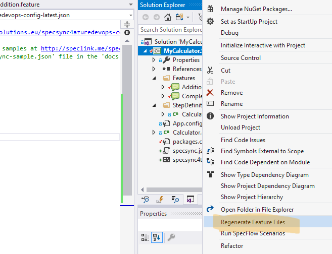

# Getting started using SpecFlow

This chapter goes through the setup and the synchronization steps for SpecFlow projects. For non-SpecFlow projects, like Cucumber, please check page [Getting started using Cucumber](getting-started-cucumber.md).

SpecSync is a synchronization tool that can be invoked from the command line. For SpecFlow projects, there is also a SpecFlow plugin that enables synchronizing automated test cases if that is necessary. This guide shows you step-by-step how the synchronization tool and the SpecFlow plugin can be configured.

## Preparation

For setting up SpecSync for TFS, you need a SpecFlow project and a TFS \(Azure DevOps\) project. For the supported TFS versions, please check the [Compatibility](../compatibility.md) list.

In our guide, we will use a calculator example \(MyCalculator\) that uses SpecFlow v2.3 with MsTest. The SpecFlow project is called `MyCalculator.Specs`. The sample project can be downloaded from [GitHub](https://github.com/gasparnagy/specsync-basic-calculator-specflow).

For a synchronization target we use an Azure DevOps project: `https://specsyncdemo.visualstudio.com/MyCalculator`. \(An Azure DevOps project for testing SpecSync can be created for free from the [Azure DevOps website](https://azure.microsoft.com/en-us/services/devops/)\).

## Installation

The SpecSync for TFS synchronization tool can be installed by adding the [`SpecSync.TFS`](https://www.nuget.org/packages/SpecSync.TFS) package from NuGet.org:

```text
PM> Install-Package SpecSync.TFS
```

The package contains the synchronization command line tool \(`tools\SpecSync4TFS.exe`\) and some documentation files \(`docs` folder\).

It also adds a `specsync4tfs.cmd` script file to the project for calling the SpecSync command line tool conveniently. SpecSync can also be used without the script file, but in this case you have to provide the full path of `SpecSync4TFS.exe` downloaded into the NuGet packages folder.

## Basic configuration

The NuGet package has added a configuration file \(`specsync.json`\) to your project that contains all SpecSync related settings. Before the first synchronization we have to review and change a few settings in this file.

1. Open the `specsync.json` file in Visual Studio from your project folder.
2. Set the value of the `remote/tfsProjectUrl` setting to the **project URL** of your TFS project. The project URL is usually in `https://server-name/project-name` or in `http://server-name:8080/tfs/project-name` form and it is not necessarily the URL of the dashboard you open normally. See [What is my TFS project URL](../important-concepts/what-is-my-tfs-project-url.md) for more details.
3. Optionally you can set your [personal access token](https://docs.microsoft.com/en-us/azure/devops/organizations/accounts/use-personal-access-tokens-to-authenticate?view=vsts) \(PAT\) as user name \(`remote/user` setting\) or choose one of the other [TFS authentication options](../important-concepts/tfs-authentication-options.md). If you don't specify credentials here, SpecSync will show an interactive authentication prompt.


## First synchronization

1. Make sure your project compiles. 
2. We recommend starting from a state where 
   * all tests pass,
   * the modified files are checked in to source control.
3. Open a command line prompt and navigate to the SpecFlow project folder \(`MyCalculator.Specs`\)
4. Call `specsync4tfs.cmd push` to invoke the synchronization.
5. If you haven't specified any credentials in the configuration file, an authentication dialog will popup, where you have to specify your credentials for accessing the TFS project.

As a result, the scenarios from the project will be linked to newly created TFS test cases, and you will see a result like this.


_Note: Scenarios are synchronized to normal, Scenario Outlines to parametrized test cases._

_Useful hint for testing:_ Normally you cannot delete work items from TFS, so testing the initial linking is harder. If you have Visual Studio installed, there is a tool called `witadmin` available from the VS command prompt. With the `destroywi` command of this tool you can delete work items. See `witadmin help destroywi` for details, and use it carefully.

## Check Test Case in TFS

1. Find one of the created test case in TFS. The easiest way to do this is to open the TFS URL in a browser and specify the test case ID \(e.g. `#12294)` in the "Search" text box in the upper right corner of the web page.

You should see something like this.


There are a couple of things you can note here.

* The name of the scenario has been synchronized as the title of the test case. \(The "Scenario:" prefix can be omitted by changing the [synchronization format configurations](../configuration/configuration-synchronization/configuration-synchronization-format.md).\)
* The tags of the scenario have been synchronized as test case tags.
* The steps of the scenario have been synchronized as test case steps. \(The _Then_ steps can also be synchronized into the _Expected result_ column of the test case step list and you can [change a couple of other formatting options](../configuration/configuration-synchronization/configuration-synchronization-format.md) as well.\)

## Verify feature file and commit changes

1. Open one of the feature files from the SpecFlow project in Visual Studio. SpecSync modified the file and added a few tags.

* Each scenario and scenario outline has been tagged with a `@tc:...` tag making the link between the scenario and the created test case.

```text
@tc:12294
@important
Scenario: Add two positive numbers
```

_Note: The feature files are changed only when synchronizing new scenarios \(linking\). To avoid file changes \(e.g. when running the synchronization from a build server\) the_ `--buildServerMode` _command line switch can be used. See_ [_Synchronizing test cases from build_](../important-concepts/synchronizing-test-cases-from-build.md) _for details._

Verify if the project still compiles and the tests pass \(they should, since we have only added tags\), and commit \(check-in\) your changes.

## Synchronize an update

Now let's make a change in one of the scenarios and synchronize the changes to the related test case.

1. Update the title and the steps of the scenario, for example change the scenario `Add two positive numbers` to `Multiply two positive numbers`, change `add` to `multiply` in the _When_ step and update the expected result to `377`:

   ```text
   @tc:12294
   Scenario: Multiply two positive numbers
     Given I have entered the following numbers
        | number |
        | 29     |
        | 13     |
     When I choose multiply
     Then the result should be 377
   ```

2. Make sure it still compiles and the test passes.
3. Run the synchronization again:

   ```text
   specsync4tfs.cmd push
   ```

The result shows that the test case for the scenario has been updated, but the other test cases have remained unchanged \(_up-to-date_\).


1. Refresh the test case in your browser to see the changed title and steps.

   

_Note: For executing complex test cases, further verification and planning steps might be required after the test case has been changed. SpecSync can reset the test case state to a configured value \(e.g._ `Design`_\) in order to ensure that these steps are not forgotten. For more information on this, check the_ [_synchronization state configuration_](https://github.com/specsolutions/specsync-for-tfs-documentation/tree/d6f47aa02bc0a49443bb765adcc0145655743ed8/configuration-synchronization-state.md) _documentation._

## Group synchronized test cases to a test suite

We have seen already how to synchronize scenarios to test cases. To be able to easily find these test cases in TFS, they can be added to test suites. SpecSync can automatically add/remove the synchronized test cases to a test suite. For this you have to specify the name or the ID or the name of the test suite in the configuration.

1. Create a "Static suite" \(e.g. "BDD Scenarios"\) in TFS. \(For that you have to navigate to "Test plans" and create and select a test plan first.\)
2. Specify the name of the test suite in the `remote/testSuite/name` entry of the `specsync.json` file. \(Alternatively you can specify the ID of the suite in `remote/testSuite/id`. The suite names are not unique in TFS!\)

   

3. Make sure that the project compiles and the tests pass.
4. Run the synchronization again:

   ```text
   specsync4tfs.cmd push
   ```

The synchronization will proceed with the result similar to this.


SpecSync has added the test cases to the test suite.


_Note: Since the test suite names are not unique in TFS, you can also specify the test suite ID in the_ `remote/testSuite/id` _setting._

## Synchronizing automated test cases \(optional\)

So far the test cases we synchronized from the scenarios were marked as "Not Automated". This means that although it is possible to execute the SpecFlow scenarios both locally and on the build server \(from the assembly built from the SpecFlow project\), the synchronized tests cases were not linked to the test method generated by SpecFlow.

If the team needs the TFS test cases for documentation and traceability and runs the scenarios from assembly, then we have already reached the desired outcome. But if the test cases have to be executed as automated test cases, we need to perform a few further steps.

In order to make the test case "Automated", there are a few restrictions that you have to consider. \(See more on this in [Synchronizing automated test cases](../important-concepts/synchronizing-automated-test-cases.md).\)

* The tests have to be automated with MsTest. This means that you have to use MsTest for SpecFlow in order to synchronize automated test cases. 
* For the test cases generated from Scenario Outlines, a single test method has to be generated \(normally SpecFlow generates one method for each example within the Scenario Outline\). This can be done using the SpecFlow plugin provided by SpecSync. 
* The SpecFlow plugin will generate additional wrapper test methods for Scenario Outlines. These have to be filtered out from local execution. 
* Only certain SpecFlow versions are supported by the SpecFlow plugin. See the [Compatibility list](../compatibility.md) for details. 

If these restrictions are acceptable in your context then the following steps can be used to enable synchronizing automated test cases.

1. Install the SpecSync SpecFlow plugin to your project as a NuGet package. For example for SpecFlow `v2.3.*`, install [`SpecSync.TFS.SpecFlow.2-3`](https://www.nuget.org/packages/SpecSync.TFS.SpecFlow.2-3).

   ```text
   PM> Install-Package SpecSync.TFS.SpecFlow.2-3
   ```

2. Enable synchronizing automated test cases by setting the `synchronization/automation/enabled` setting to `true` in the `specsync.json` file. \(You can enable this only for selected scenarios. See [automation configuration](../configuration/configuration-synchronization/configuration-synchronization-automation.md) for details.\) 
3. Regenerate feature files by invoking "Regenerate Feature Files" from the context menu of the SpecFlow project node in the "Solution Explorer" window. This step is not necessary if you use [MsBuild generation for SpecFlow](https://specflow.org/documentation/Generate-Tests-from-MsBuild/). 
4. Compile the project. For each Scenario Outline, there will be an additional wrapper test generated that will be used by the automated test case. Running these tests locally is unnecessary, therefore it is recommended to filter them out from local execution. This can be done for example by entering the `-Trait:SpecSyncWrapper` filter criteria to the search box of the "Test Explorer" window. \(See more in [SpecFlow configuration](../configuration/configuration-specflow.md).\) 
5. Run the synchronization again:

   ```text
   specsync4tfs.cmd push
   ```

As a result of the synchronization, the test cases are marked as "Automated" and the test methods are associated with the test cases.


Make sure you check in \(commit and push\) your changes, so that there is a build with a compiled assembly that contains the wrapper methods. You can now run these tests cases from TFS for that build. About running the automated test cases, please refer to the [Azure DevOps \(TFS\) documentation](https://docs.microsoft.com/en-us/azure/devops/test/run-automated-tests-from-test-hub?view=vsts).

