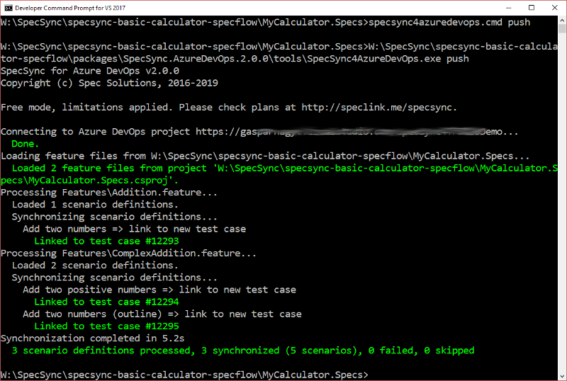

# Getting started using SpecFlow

This chapter goes through the setup and the synchronization steps for SpecFlow projects. For non-SpecFlow projects, like Cucumber, please check page [Getting started using Cucumber](getting-started-cucumber.md).

SpecSync is a synchronization tool that can be invoked from the command line. For SpecFlow projects, there is also a SpecFlow plugin that enables synchronizing automated test cases if that is necessary. This guide shows you step-by-step how the synchronization tool and the SpecFlow plugin can be configured.

## Preparation

For setting up SpecSync for Azure DevOps, you need a SpecFlow project and a Azure DevOps project. For the supported Azure DevOps versions, please check the [Compatibility](../reference/compatibility.md) list.

In our guide, we will use a calculator example \(MyCalculator\) that uses SpecFlow v2.3 with MsTest. The SpecFlow project is called `MyCalculator.Specs`. The sample project can be downloaded from [GitHub](https://github.com/gasparnagy/specsync-basic-calculator-specflow).

For a synchronization target we use an Azure DevOps project: `https://specsyncdemo.visualstudio.com/MyCalculator`. \(An Azure DevOps project for testing SpecSync can be created for free from the [Azure DevOps website](https://azure.microsoft.com/en-us/services/devops/)\).

## Installation

There are multiple installation options you can choose from depending on your operating system and the development platform \(see details at [Installation & Setup](../installation/) page\). In this guide we configure SpecSync for a .NET Core 3.1 project and will install SpecSync as a [local .NET Core Tool](../installation/dotnet-core-tool.md).

If SpecSync is the first local .NET Core tool in your project, you have to initialize the .NET Core tool configuration first. For that open a command line prompt and go to your solution folder.

```text
dotnet new tool-manifest
```

Once the configuration is initialized, you can install SpecSync. Change the current directory to your SpecFlow project folder \(`MyCalculator.Specs` in our case\) and install the SpecSync package:

```text
cd MyCalculator.Specs
dotnet tool install SpecSync.AzureDevOps 
```

If the installation was successful, you can invoke SpecSync using the `dotnet specsync` command. For example the following command displays the version of SpecSync.

```text
dotnet specsync version
```


You can find more information about this installation option in the [Install as .NET Core tool](../installation/dotnet-core-tool.md) page.


## Initialize configuration

Initialize the SpecSync configuration in your local repository root by invoking the SpecSync init command. This command will create a SpecSync configuration file `specsync.json`.

```text
dotnet specsync init
```

The init command will ask you for your [Azure DevOps project URL](../important-concepts/what-is-my-tfs-project-url.md) and the [authentication credentials](../features/general-features/tfs-authentication-options.md). Alternatively you can manually create the configuration based on an empty configuration file downloadable from [http://schemas.specsolutions.eu/specsync-empty.json](http://schemas.specsolutions.eu/specsync-empty.json).

## Review configuration

The init command configured the connection details to your Azure DevOps project. This is enough to start the first synchronization. But before we move on with that, let's review the created configuration file.

Open the `specsync.json` file in Visual Studio or another IDE from your project folder. The file should contain configuration settings similar to the ones below.


```javascript
{
  "$schema": "http://schemas.specsolutions.eu/specsync4azuredevops-config-latest.json",

  // See configuration options and samples at http://speclink.me/specsyncconfig.
  // You can also check the 'specsync-sample.json' file in the 'docs' folder of the NuGet package.

  "remote": {
    "projectUrl": "https://specsyncdemo.visualstudio.com/MyCalculator",
    "user": "52yny........................................ycsetda"
  }
}
```


## First synchronization

1. Make sure your project compiles. 
2. We recommend starting from a state where 
   * all tests pass,
   * the modified files are checked in to source control.
3. Open a command line prompt and navigate to the SpecFlow project folder \(`MyCalculator.Specs`\)
4. Invoke SpecSync push command:

   ```text
   dotnet specsync push
   ```

5. If you haven't specified any credentials in the configuration file, an authentication dialog will popup, where you have to specify your credentials for accessing the Azure DevOps project.

As a result, the scenarios from the project will be linked to newly created Azure DevOps test cases, and you will see a result like this.



Scenarios are synchronized to normal, Scenario Outlines to parametrized test cases.


_Useful hint for testing:_ Normally you cannot delete work items from Azure DevOps, so testing the initial linking is harder. If you have Visual Studio installed, there is a tool called `witadmin` available from the VS command prompt. With the `destroywi` command of this tool you can delete work items. See `witadmin help destroywi` for details, and use it carefully.


## Check Test Case in Azure DevOps

1. Find one of the created test case in Azure DevOps. The easiest way to do this is to open the Azure DevOps URL in a browser and specify the test case ID \(e.g. `#12294)` in the "Search" text box in the upper right corner of the web page.

You should see something like this.


There are a couple of things you can note here.

* The name of the scenario has been synchronized as the title of the test case. \(The "Scenario:" prefix can be omitted by changing the [synchronization format configurations](../reference/configuration/configuration-synchronization/configuration-synchronization-format.md).\)
* The tags of the scenario have been synchronized as test case tags.
* The steps of the scenario have been synchronized as test case steps. \(The _Then_ steps can also be synchronized into the _Expected result_ column of the test case step list and you can [change a couple of other formatting options](../reference/configuration/configuration-synchronization/configuration-synchronization-format.md) as well.\)

## Verify feature file and commit changes

1. Open one of the feature files from the SpecFlow project in Visual Studio. SpecSync modified the file and added a few tags.
2. Each scenario and scenario outline has been tagged with a `@tc:...` tag making the link between the scenario and the created test case.

```text
@tc:12294
@important
Scenario: Add two positive numbers
```


The feature files are changed only when synchronizing new scenarios \(linking\). To avoid file changes \(e.g. when running the synchronization from a build server\) the `--disableLocalChanges` command line switch can be used. See [Synchronizing test cases from build](../important-concepts/synchronizing-test-cases-from-build.md) for details.


Verify if the project still compiles and the tests pass \(they should, since we have only added tags\), and commit \(check-in\) your changes.

## Synchronize an update

Now let's make a change in one of the scenarios and synchronize the changes to the related test case.

1. Update the title and the steps of the scenario, for example change the scenario `Add two positive numbers` to `Multiply two positive numbers`, change `add` to `multiply` in the _When_ step and update the expected result to `377`:

   ```text
   @tc:12294
   Scenario: Multiply two positive numbers
     Given I have entered the following numbers
        | number |
        | 29     |
        | 13     |
     When I choose multiply
     Then the result should be 377
   ```

2. Make sure it still compiles and the test passes.
3. Run the synchronization again:

   ```text
   dotnet specsync push
   ```

The result shows that the test case for the scenario has been updated, but the other test cases have remained unchanged \(_up-to-date_\).


1. Refresh the test case in your browser to see the changed title and steps.

   


For executing complex test cases, further verification and planning steps might be required after the test case has been changed. SpecSync can reset the test case state to a configured value \(e.g. `Design`\) in order to ensure that these steps are not forgotten. For more information on this, check the [synchronization state configuration](../reference/configuration/configuration-synchronization/configuration-synchronization-state.md) documentation.


## Group synchronized test cases to a test suite

We have seen already how to synchronize scenarios to test cases. To be able to easily find these test cases in Azure DevOps, they can be added to test suites. SpecSync can automatically add/remove the synchronized test cases to a test suite. For this you have to specify the name or the ID or the name of the test suite in the configuration.

1. Create a "Static suite" \(e.g. "BDD Scenarios"\) in Azure DevOps. \(For that you have to navigate to "Test plans" and create and select a test plan first.\)
2. Specify the name of the test suite in the `remote/testSuite/name` entry of the `specsync.json` file. \(Alternatively you can specify the ID of the suite in `remote/testSuite/id`. The suite names are not unique in Azure DevOps!\)

   ```javascript
   {
     "$schema": "http://schemas.specsolutions.eu/specsync4azuredevops-config-latest.json",

     // See configuration options and samples at http://speclink.me/specsyncconfig.
     // You can also check the 'specsync-sample.json' file in the 'docs' folder of the NuGet package.

     "remote": {
       "projectUrl": "https://specsyncdemo.visualstudio.com/MyCalculator",
       "user": "52yny4a......................................ycsetda",
       "testSuite": {
         "name": "BDD Scenarios"
       }
     }
   }
   ```

3. Make sure that the project compiles and the tests pass.
4. Run the synchronization again:

   ```text
   dotnet specsync push
   ```


_Since the test suite names are not unique in Azure DevOps, you can also specify the test suite ID in the_ `remote/testSuite/id` _setting._


The synchronization will proceed with the result similar to this.


SpecSync has added the test cases to the test suite.



For projects with many Test Suite it is recommended to also specify the Test Plan ID, where the Test Suite belongs to. This makes the synchronization faster.


## Publishing test results \(optional\)

So far we have shown how to keep the Azure DevOps Test Cases in sync with the scenarios in the feature files. This provides you easily accessible documentation and traceability. The synchronized Test Cases can also be executed as manual tests from Azure DevOps.

To turn the Test Cases into a living documentation, you can also publish test results of the scenarios connected to the Test Cases and Test Suites. 

The easiest way to do this is to execute the SpecFlow scenarios as you would do normally and use the [publish-test-result command](../reference/command-line-reference/publish-test-results-command.md) of SpecSync to publish these results to Azure DevOps. 


To be able to publish test results to Azure DevOps, the Test Cases have to be added to a Test Suite. In this guide we have configured SpecSync to add them to a Test Suite called `BDD Scenarios` in an earlier step.


First let's execute the tests. In this example we use a fixed test result file name `testresult.trx`.

```bash
dotnet test --logger trx;logfilename=testresult.trx
```

When the test execution has been finished, the test result file is updated. The default location of the file is the `TestResults` folder.

Now lets publish these results using the publish-test-results command of SpecSync. 

```bash
dotnet specsync publish-test-results --testResultFile TestResults\testresult.trx
```

The command analyses the test result file and connects the results with the scenarios to be able to associate them to Test Cases. You can find the created Test Run in the _Test Plans / Runs_ section of your Azure DevOps portal.


To find more information about the available options on how to publish test results, please check the [Synchronizing automated test cases](../important-concepts/synchronizing-automated-test-cases.md) page.


