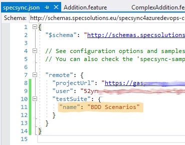

# Group synchronized test cases to a test suite

To be able to easily find these synchronized test cases in Azure DevOps, they can be added to test suites. SpecSync can automatically add/remove the synchronized test cases to a test suite. For this you have to specify the name or the ID or the name of the test suite in the configuration.

1. Create a "Static suite" \(e.g. "BDD Scenarios"\) in Azure DevOps. \(For that you have to navigate to "Test plans" and create and select a test plan first.\)
2. Specify the name of the test suite in the `remote/testSuite/name` entry of the `specsync.json` file. \(Alternatively you can specify the ID of the suite in `remote/testSuite/id`. The suite names are not unique in Azure DevOps!\)

   

3. Make sure that the project compiles and the tests pass.
4. Run the synchronization again:

   ```text
   path-to-specsync-package\tools\SpecSync4AzureDevOps.exe push
   ```

As a result, SpecSync adds the synchronized test cases to the test suite.


If you specify a test suite name that does not exist, SpecSync creates a test suite first \(under the first test plan\).

_Note: Since the test suite names are not unique in Azure DevOps, you can also specify the test suite ID in the_ `remote/testSuite/id` _setting._

