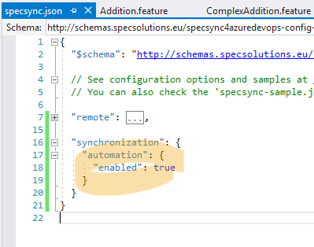

# Synchronizing automated test cases

_**Important: This article describes the behavior of SpecSync for Azure DevOps v2.1 or later. This version introduced major improvements for automated test cases. For the v2.0 behavior, please check this article.**_ 

The test cases synchronized by SpecSync can also track test executions and test results through the "Test Run" infrastructure of Azure DevOps. This might be useful to create a "Living Documentation" -- a description of the expected system behavior that can also indicate whether the solution currently fulfills these expectations or not. Tracking the test results for the test cases is optional.

The test results in Azure DevOps are always registered to a _Test Point_. A Test Point is an association of a _Test Case_, a _Test Suite_ contains the Test Case and a _Test Configuration_ that is associated to the Test Suite.

Besides tracking the test results the test cases can also be marked as "Automated", although test results can also be registered to a non-automated test case as well.

SpecSync supports two main test execution strategies for tracking test case results:

* **Assembly based execution** -- the scenarios are executed from the test assembly locally or in a build/release pipeline and the test results are published to the linked test cases by invoking the SpecSync `publish-test-results` command.
* **Test Suite based execution** -- the automated test cases are executed by Azure DevOps using a Visual Studio Test \(VSTest\) task in a build or release pipeline that is configured to select tests using a Test Plan.

Currently these strategies work only with SpecFlow projects. For non-SpecFlow projects \(e.g. Cucumber projects\), SpecSync can synchronize the scenarios to **non-automated test cases**. The synchronized non-automated test cases can be managed, linked and structured in Azure DevOps. We plan to support the Assembly based execution strategy for non-SpecFlow projects as well, please [contact us](https://www.specsolutions.eu/contact/) if you would like to use this feature.

## Assembly based execution strategy

The assembly-based execution strategy is the most generally applicable strategy and it requires the least changes in a usual continuous integration \(CI\) process.

The core concept of the Assembly based execution strategy is that the scenarios are executed using the compiled test assembly like usual, and the execution results are published by SpecSync in a way that the individual test results will be connected to the Test Case work items synchronized from the scenarios.

### Step 0: Configure SpecSync

In order to publish test results to a test case in Azure DevOps, the test case has to be included to a Test Suite. This can be achieved by configuring the test suite name in the [`remote/testSuite`](../configuration/configuration-remote.md) entry of the configuration file. See [Group synchronized test cases to a test suite](group-synchronized-test-cases-to-a-test-suite.md) for details.

```javascript
{
  ...
  "remote": {
    ...
    "testSuite": {
      "name": "BDD Scenarios"
    }
  },
  ...
}
```

Although for this strategy it is not required, you can synchronize the test cases as automated test cases to indicate their execution type. In this case, you need to specify `assemblyBasedExecution` as `testExecutionStrategy` in the [`synchronization/automation`](../configuration/configuration-synchronization/configuration-synchronization-automation.md) section of the configuration file.

```javascript
{
  ...
  "synchronization": {
    ...
    "automation": {
      "enabled": true,
      "testExecutionStrategy": "assemblyBasedExecution"
    },
    ...
  },
  ...
}
```

### Step 1: Synchronize the scenarios to make sure the test cases are up-to-date

To be able to publish the test results to the appropriate test cases it is recommended to perform a synchronization before executing the tests and publishing the results using the SpecSync `push` command. See [Usage](../usage.md) for details.

### Step 2: Execute scenarios from test assembly

The scenarios can be executed locally, using the `vstest.console` or the `dotnet test` commands, or in an Azure DevOps build/release pipeline using the Visual Studio Test \(VSTest\) task. In either case, the test execution has to be configured in a way that it saves the test results into a TRX file.

The following examples show how this can be achieved.

```bash
vstest.console bin\Debug\MyTestAssembly.dll  /logger:trx;LogFileName=testresult.trx
```

```bash
dotnet test --logger trx;logfilename=testresult.trx
```



The TRX files you specify will be saved to a `TestResults` folder. So using the configuration above, the TRX file will be saved to `TestResults\testresult.trx`.


### Step 3: Publish test results using SpecSync

The test results saved into the TRX file can be published by SpecSync using the `publish-test-results` command. The command will match the individual test results to the test cases linked to the scenarios, but the matching can only work if the scenarios have been synchronized recently and if the test cases are also synchronized to a Test Suite \(see Step 1\). 

The publish-test-results command has to be provided with the following settings

* Path of the TRX file generated by the test execution in Step 2
* The Azure DevOps Test Configuration to associate the test results with. 

You can find the available Test Configurations in the "Test Plans / Configuration" section of the Azure DevOps project page, but if you specify a wrong test configuration value, SpecSync will also list the available options.

The TRX file and the Test Configuration can be specified either in the configuration file \([`publishTestResults`](../configuration/publishtestresults.md) section\) or as a command line argument, as the following example shows.

```bash
path-to-specsync-package\tools\SpecSync4AzureDevOps.exe publish-test-results 
  --testConfiguration "Windows 10" --testResultFile TestResults\testresult.trx
```

As a result of the `publish-test-results` command a new Test Run will be registered and the test results will be associated to the test cases as you can see when you open the Test Suite in Azure DevOps.


## Suite based execution strategy

## Suite based execution strategy with Scenario Outline wrappers


[Azure DevOps Test Case automation currently supports MsTest-base \(V1\) automation only.](https://docs.microsoft.com/en-us/azure/devops/test/associate-automated-test-with-test-case?view=vsts) This means that with SpecSync, this feature can only be used with SpecFlow projects using MsTest unit test runner.

For all other cases \(e.g. for Cucumber projects or xUnit-based SpecFlow projects\), SpecSync can synchronize the scenarios to **non-automated test cases**. The synchronized non-automated test cases can be managed, linked and structured in Azure DevOps. You can run them manually as well. It is also possible to upload test result for these tests using the Azure DevOps API.

## Setting up synchronization of automated test cases for SpecFlow

In order to make the test case "Automated", there are a few restrictions that you have to consider.

* The tests have to be automated with MsTest. This means that you have to use MsTest for SpecFlow in order to synchronize automated test cases. 
* For the [test cases generated from Scenario Outlines](synchronizing-scenario-outlines.md), a single test method has to be generated \(normally SpecFlow generates one method for each example within the Scenario Outline\). This can be done using the SpecFlow plugin provided by SpecSync. 
* The SpecFlow plugin will generate additional wrapper test methods for Scenario Outlines. These have to be filtered out from local execution. 
* Only certain SpecFlow versions are supported by the SpecFlow plugin. See the [Compatibility list](../compatibility.md) for details. 

If these restrictions are acceptable in your context then the following steps can be used to enable synchronizing automated test cases.

1. Install the SpecSync SpecFlow plugin to your project as a NuGet package. For example for SpecFlow `v2.3.*`, install [`SpecSync.AzureDevOps.SpecFlow.2-3`](https://www.nuget.org/packages/SpecSync.AzureDevOps.SpecFlow.2-3).

   ```text
   PM> Install-Package SpecSync.AzureDevOps.SpecFlow.2-3
   ```

2. Enable synchronizing automated test cases by setting the `synchronization/automation/enabled` setting to `true` in the `specsync.json` file. \(You can enable this only for selected scenarios. See [automation configuration](../configuration/configuration-synchronization/configuration-synchronization-automation.md) for details.\) 
3. Regenerate feature files by invoking "Regenerate Feature Files" from the context menu of the SpecFlow project node in the "Solution Explorer" window. This step is not necessary if you use [MsBuild generation for SpecFlow](https://specflow.org/documentation/Generate-Tests-from-MsBuild/). 
4. Compile the project. For each Scenario Outline, there will be an additional wrapper test generated that will be used by the automated test case. Running these tests locally is unnecessary, therefore it is recommended to filter them out from local execution. This can be done for example by entering the `-Trait:SpecSyncWrapper` filter criteria to the search box of the "Test Explorer" window. \(See more in [SpecFlow configuration](../configuration/configuration-specflow.md).\) 
5. Run the synchronization again:

   ```text
   specsync4azuredevops.cmd push
   ```

As a result of the synchronization, the test cases are marked as "Automated" and the test methods are associated with the test cases.


## Filter out wrapper methods in Azure DevOps pipeline build

When the tests are run in Azure DevOps build from assembly \(so not through the test cases\), the generated wrapper methods have the be filtered out as well. This can be achieved by entering the `TestCategory!=SpecSyncWrapper` expression as "Test Filter criteria".


