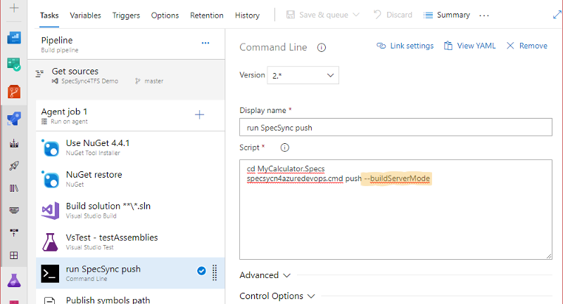

# Synchronizing test cases from build

Keeping the test cases in sync with the scenarios is important, therefore automating the synchronization process is recommended. This can be done for example from builds: you can configure an additional build step that invokes the synchronization process.

Creating the initial link between scenarios and test cases requires a small change in the feature file \(to include the test case tags\). Such changes cannot be done in an automated process, because the changes cannot be committed to the source control. To handle this, SpecSync provides a `--buildServerMode` switch \(see [Usage](../usage.md) for more details\). If this switch is provided, SpecSync will not synchronize new scenarios, but only updates the ones that are already linked to test cases.

For [authentication](tfs-authentication-options.md), it is recommended to create a special user account that has sufficient privileges \(modify test cases and test suites\). The user name and password for the special account can be specified to the build task as an environment variable. When specifying the user name and password \(both in the configuration file or as a command line option\), you can use environment variables in the `%variable%` form.

```text
{
  ...
 "remote": {
    "projectUrl": "https://dev.azure.com/myorganization/MyProject",
    "user": "%SYNC_USER%",
    "password": "%SYNC_PWD%"
  },
  ...
}
```




For information on how to configure the build executing automated test cases, please check the [Synchronizing automated test cases](synchronizing-automated-test-cases.md) article. 


