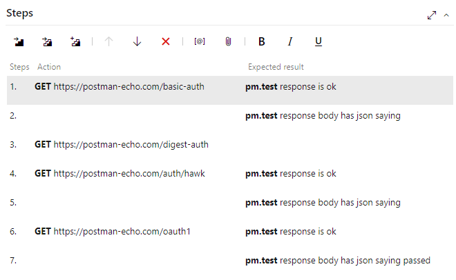
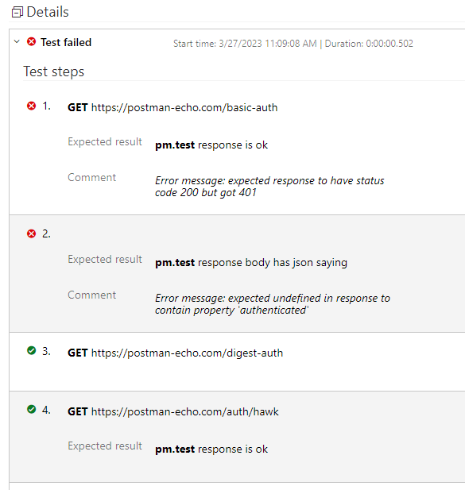

# Using SpecSync with Postman

[Postman](https://www.postman.com/) is a popular REST API testing tool with a cloud-based storage for Postman Collections.

SpecSync can be used to synchronize the tests defined in Postman with Azure DevOps Test Cases and publish test results of Postman tests executed with [Newman](https://learning.postman.com/docs/collections/using-newman-cli/command-line-integration-with-newman/).

In order to use SpecSync with Postman tests, you need to enable the [`SpecSync.Plugin.PostmanTestSource`](https://github.com/specsolutions/specsync-sample-plugins/tree/main/postman-test-source-plugin) plugin by adding the following section to the SpecSync configuration file (`specsync.json`).

```javascript
  "toolSettings": {
    "plugins": [
      {
        "packageId": "SpecSync.Plugin.PostmanTestSource",
        "packageVersion": "1.0.0", // check the latest version at https://www.nuget.org/packages/SpecSync.Plugin.PostmanTestSource
        "parameters": {
          "collectionId": "[the ID of the postman collection you want to synchronize]",
          "postmanApiKey": "[your Postman API key]" // you can set it via the POSTMAN_API_KEY environment variable as well
        }
      }
    ]
  },
```


You can find the Collection ID in Postman by selecting the *Info* sidebar on the right.


You might need to set other settings a well, as described below. You can find a complete configuration sample in the [*Sample SpecSync configuration file for synchronizing Postman tests* section](#sample-config) below.


The _Postman Test Source_ plugin described here is an [Enterprise feature](../licensing.md).



## Planning the Postman integration

Postman collections contain folders, sub-folders and requests. Requests can have additional `pm.test` checks as well. Postman does not define an exact "test" concept. Some teams think about the `pm.test` checks as tests, some use a request as a test and for some a test is a folder that contain multiple requests in a sequence. 

SpecSync synchronizes the tests to Azure DevOps Test Cases, so when planning the Postman integration the first thing you need to decide is what is a test for you in your Postman Collection.

By default SpecSync will treat the Requests as tests but you can also instruct SpecSync to use a folder as tests in the following ways:

1. You can specify a Regular Expression pattern that should match to the folder names you would like to treat as tests. This is useful if you maintain a naming convention for your test-folders. To use this, you need to set the [`testNameRegex` parameter](https://github.com/specsolutions/specsync-sample-plugins/tree/main/postman-test-source-plugin#plugin-parameters). For example, if all of these folders start with the word `TEST-` you need to set the `testNameRegex` parameter to `^TEST-`.
2. You can specify a Regular Expression pattern that should match to a specific text in the folder documentation. To use this, you need to set the [`testDocumentationRegex` parameter](https://github.com/specsolutions/specsync-sample-plugins/tree/main/postman-test-source-plugin#plugin-parameters). For example, if the documentation of the test-folders contain a "Test Case" H2 heading, you need to set the `testDocumentationRegex` parameter to `(?m)^## Test Case` (the `(?m)` regex setting will enable multi-line mode so that `^` will match begin of each line).

You might want to exclude some folders and requests from synchronization or only enable synchronization for particular folders. For that, you can use the `local/condition` or the `local/sourceFiles` settings. (See related [reference](../reference/configuration/configuration-local.md).) For example to exclude the Postman folder `Legacy` from the synchronization, you need to specify:

```
  "local": {
    "sourceFiles": [
      "not '**/Legacy'"
    ]
  },
```


It is recommended to first test the synchronization settings with a cloned collection. You can check how the synchronization works before actually modifying anything by providing the `--dryRun` option.


## Storing SpecSync meta-data

SpecSync needs to preserve the ID of the linked Test Case in the Postman item (folder or request). As Postman does not support creating custom fields or add tags for these items, SpecSync stores this data by default in the documentation of the items in a separate section named `SpecSync` by default. (You can use a different name by specifying the [`metadataHeading` parameter](https://github.com/specsolutions/specsync-sample-plugins/tree/main/postman-test-source-plugin#plugin-parameters).) 

Besides the ID of the linked Test Case, you can store other information (meta-data) in this section that is useful for the synchronization: you can specify tags that are going to be synchronized as Test Case tags in Azure DevOps and you can also specify links to other work items that will be synchronized as links using the [Linking work items using tags](../features/common-synchronization-features/linking-work-items-with-tags.md) feature.

The IDs of the linked artifacts (Test Case, work items) can be defined as a link, so if someone visits the test in Postman they can easily navigate to the related artifact. SpecSync automatically creates such links when a new test is linked to a new Test Case.

The following example shows the documentation of a Postman item, that is linked to the Test Case 1234, annotated with the `fast` and `important` tags and linked to the User Story 123 (assuming that the `story` prefix is configured in [`synchronization/links`](../reference/configuration/configuration-synchronization/configuration-synchronization-links.md)).

```
This endpoint echoes the HTTP headers, request parameters and the complete  
URI requested.

## SpecSync

- tc: [1234](https://specsyncdemo.visualstudio.com/MyCalculator/_workitems/edit/1234)
- tags:
    - fast
    - important
- links:
    - story: [123](https://specsyncdemo.visualstudio.com/MyCalculator/_workitems/edit/123)
```

The meta-data section is automatically added to the documentation when SpecSync links the test to a newly created Test Case, but can also be added manually.


The meta-data can also be specified on a higher level folders or even on the collection itself. For example specifying a story link in a top-level folder will connect all Test Cases to the selected User Story that are synchronized from the tests within that folder.


## Synchronizing Postman tests

You can synchronize the already linked Postman tests or link the new tests to newly created Test Cases with the SpecSync [push command](../reference/command-line-reference/push-command.md). If you just want to synchronize the linked tests, but not link the new ones, you can use the `--disableLocalChanges` option.

```text
dotnet specsync push
```

During synchronization SpecSync will analyze the Postman test folders or requests and convert them to Test Case steps in a way that all requests will become a step and all `pm.test` check will be shown as an expected result. For the best display it is recommended to set the [`synchronization/format/useExpectedResult` setting](../reference/configuration/configuration-synchronization/configuration-synchronization-format.md) to `true`, otherwise the `pm.test` checks will be displayed as separate step.



## Publishing Test Results

The plugin can also [publish test execution results]((../features/test-result-publishing-features/publishing-test-result-files.md) to the synchronized Test Cases. For that first you need to run the Postman tests with [Newman](https://learning.postman.com/docs/collections/using-newman-cli/command-line-integration-with-newman/) using the `junit` reporter. E.g.

```
newman run "https://api.getpostman.com/collections/[your-collection-id]?apikey=[your-api-key]" --reporters "cli,junit" --reporter-junit-export TestResults\result.xml
```

Once the tests have executed and the result XML file has been created, you can use the SpecSync `publish-test-results` command with the `NewmanJUnitXml` format to publish the results to the remote server.

```
dotnet specsync publish-test-results -r .\TestResults\result.xml -f NewmanJUnitXml
```


If you have multiple environments defined in Postman, you can define the environment names in Azure DevOps as ["Test Configurations"](https://learn.microsoft.com/en-us/azure/devops/test/test-different-configurations?view=azure-devops&tabs=browser) and [specify the test configuration](../features/test-result-publishing-features/publishing-test-result-files.md#test-results-belong-to-a-test-configuration) for the `publish-test-results` command using the [`-c` option](../reference/command-line-reference/publish-test-results-command.md), e.g. `-c Staging`.


SpecSync analyzes the test results and matches them to the steps of the test case. As a result you can have a detailed, step-level test report in Azure DevOps. 




## Sample SpecSync configuration file for synchronizing Postman tests <a href="sample-config" id="sample-config"></a>

```javascript
{
  "$schema": "https://schemas.specsolutions.eu/specsync4azuredevops-config-latest.json",
  "compatibilityVersion": "3.4",

  "toolSettings": {
    "plugins": [
      {
        "packageId": "SpecSync.Plugin.PostmanTestSource",
        "packageVersion": "1.0.0",
        "parameters": {
          "collectionId": "26495037-5c8d6f15-b2a3-4b47-ae1d-72dd3bc1b49b",
          "testNameRegex": "^TEST-"
        }
      }
    ]
  },
  "remote": {
    "projectUrl": "https://specsyncdemo.visualstudio.com/MyCalculator",
    "testSuite": {
      "name": "PostmanTestSource",
      "testPlan": "My Plan"
    }
  },
  "synchronization": {
    "automation": {
      "enabled": true, // marks the Test Cases as automated
      "automatedTestType": "Postman"
    },
    "format": {
      "useExpectedResult": true // uses the "expected result" field for "pm.test" checks
    },
    "links": [
      {
        "tagPrefix": "story" //enables linking to User Stories
      }
    ],
    "fieldUpdates": {
      "Description": "{local-test-case-description:HTML}" // adds the documentation content to the description field
    }
  }
}
```
