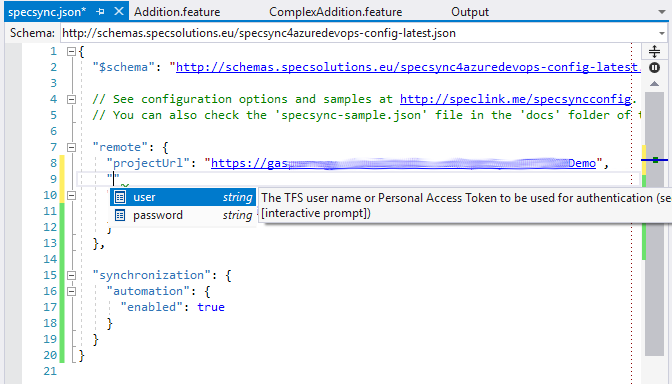

# Configuration

This section contains a detailed reference of the SpecSync configuration options.

For a detailed setup instructions, please check the [Getting started](../../getting-started/) guide. For a complete list of command line options of the synchronization tool check the [Usage](../command-line-reference/) documentation.

## The `specsync.json` configuration file.

SpecSync can be configured using a json configuration file, by default called `specsync.json`. This file contains all information required to perform the different synchronization tasks. Some settings of the configuration file can be also overridden from the command line options of the synchronization tool, these are listed in the [Usage](../command-line-reference/) guide.

The `specsync.json` configuration file is a standard JSON file, but it also allows `//` style comments. There is a JSON schema available for the configuration file that contains the available configuration options and a short description.

**Open the SpecSync config files in Visual Studio \(or other editor that supports JSON schema, like Visual Studio Code\) to get auto-completion for editing and documentation hints if you hover your mouse over a setting.**



## Examples

The following example shows a minimal configuration file.

```javascript
{
  "$schema": "http://schemas.specsolutions.eu/specsync4azuredevops-config-latest.json",

  "remote": {
    "projectUrl": "https://specsyncdemo.visualstudio.com/MyCalculator",
  }
}
```

A detailed sample configuration file that contains nearly all settings can be found at [http://schemas.specsolutions.eu/specsync-sample.json](http://schemas.specsolutions.eu/specsync-sample.json).

## Configuration sections

The settings in the configuration file are grouped into different configuration sections. Each configuration section is a JSON object following the syntax:

```javascript
{  // start of the file
  ...
  "section1": {
    // settings for section 'section1' 
  },
  ...  
}  // end of the file
```

_Note: The leading comma \(_`,`_\) after the curly brace close \(_`}`_\) of_ `section1` _is not needed if this is the last section in the file._

## Available configuration sections

The following configuration sections can be used. Click to the name of the section for detailed documentation.

* [`toolSettings`](configuration-toolsettings.md) -- settings for the synchronization tool
* [`local`](configuration-local.md) -- settings for the local repository \(file system\) containing the feature files
* [`remote`](configuration-remote.md) -- Settings for accessing the test cases on the remote Azure DevOps server
* [`synchronization`](configuration-synchronization/) -- synchronization settings
* [`specFlow`](configuration-specflow.md) -- settings related to synchronizing SpecFlow projects
* [`customizations`](configuration-customizations.md) -- configure customizations

