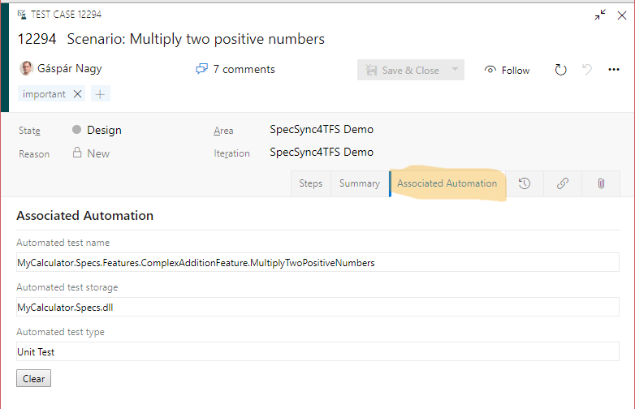

# Synchronizing automated test cases

The TFS Test Cases can have associated automation, so that they can be executed as a part of the TFS build, release or by executing a test plan.

Please note that tests can be executed from build and release even without associating automation to test cases, e.g. by running all tests from an assembly. The difference is that if the tests are not executed through the test cases, these executions will not be trackable from the test cases.

TFS Test Case automation currently supports MsTest-base automation only. This means that with SpecSync, this feature can only be used with SpecFlow projects using MsTest unit test runner. 

For all other cases \(e.g. for Cucumber projects or xUnit-based SpecFlow projects\), SpecSync can synchronize the scenarios to **non-automated test cases**. The synchronized non-automated test cases can be managed, linked and structured in TFS. You can run them manually as well. It is also possible to upload test result for these tests using the TFS API.

## Setting up synchronization of automated test cases for SpecFlow

In order to make the test case "Automated", there are a few restrictions that you have to consider. 

* The tests have to be automated with MsTest. This means that you have to use MsTest for SpecFlow in order to synchronize automated test cases. 
* For the [test cases generated from Scenario Outlines](synchronizing-scenario-outlines.md), a single test method has to be generated (normally SpecFlow generates one method for each example within the Scenario Outline). This can be done using the SpecFlow plugin provided by SpecSync. 
* The SpecFlow plugin will generate additional wrapper test methods for Scenario Outlines. These have to be filtered out from local execution. 
* Only certain SpecFlow versions are supported by the SpecFlow plugin. See the [Compatibility list](compatibility.md) for details. 

If these restrictions are acceptable in your context then the following steps can be used to enable synchronizing automated test cases.
 

1. Install the SpecSync SpecFlow plugin to your project as a NuGet package. For example for SpecFlow `v2.3.*`, install [`SpecSync.TFS.SpecFlow.2-3`](https://www.nuget.org/packages/SpecSync.TFS.SpecFlow.2-3).

   ```
   PM> Install-Package SpecSync.TFS.SpecFlow.2-3
   ```

2. Enable synchronizing automated test cases by setting the `synchronization/automation/enabled` setting to `true` in the `specsync.json` file. (You can enable this only for selected scenarios. See [automation configuration](configuration/configuration-synchronization-automation.md) for details.)
 

3. Regenerate feature files by invoking "Regenerate Feature Files" from the context menu of the SpecFlow project node in the "Solution Explorer" window. This step is not necessary if you use [MsBuild generation for SpecFlow](https://specflow.org/documentation/Generate-Tests-from-MsBuild/).
 

4. Compile the project. For each Scenario Outline, there will be an additional wrapper test generated that will be used by the automated test case. Running these tests locally is unnecessary, therefore it is recommended to filter them out from local execution. This can be done for example by entering the `-Trait:SpecSyncWrapper` filter criteria to the search box of the "Test Explorer" window. (See more in [SpecFlow configuration](configuration/configuration-specflow.md).) 
 

5. Run the synchronization again:
   ```
   specsync4tfs.cmd push
   ```

As a result of the synchronization, the test cases are marked as "Automated" and the test methods are associated with the test cases.



## Filter out wrapper methods in TFS build

When the tests are run in TFS build from assembly (so not through the test cases), the generated wrapper methods have the be filtered out as well. This can be achieved by entering the `TestCategory!=SpecSyncWrapper` expression as "Test Filter criteria".


